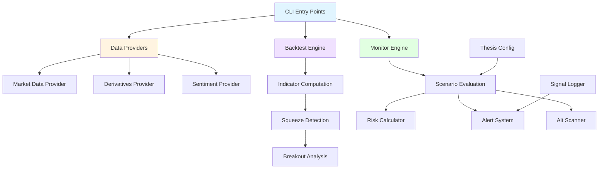
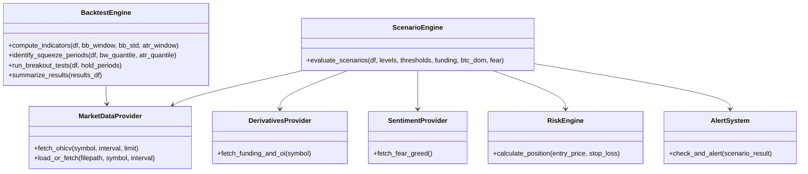
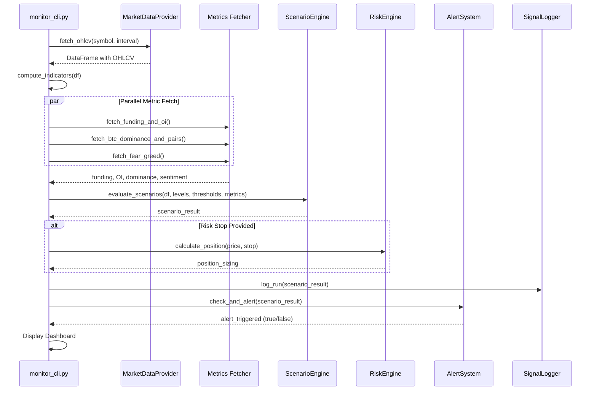

# BTC Microanalyst: Bollinger Squeeze Thesis Monitor

[](https://www.python.org/downloads/)
[]()

**A real-time Bitcoin trading thesis validation engine combining Bollinger Band squeeze detection, derivative metrics analysis, and multi-scenario liquidation pulse monitoring.**

---

## Table of Contents

- [Quickstart](#quickstart)
- [Architecture](#architecture)
- [How-To Guides](#how-to-guides)
- [Reference](#reference)
- [Explanation](#explanation)

---

## Quickstart

### Installation

```bash
# Clone repository
git clone <repository-url>
cd <repository-root>

# Install dependencies
pip install -r requirements.txt
```

### Basic Usage

**Run Historical Backtest:**
```bash
python main.py --file data/BTCUSDT_1h.csv --symbol BTCUSDT --interval 1h
```

**Live Thesis Monitor:**
```bash
python monitor_cli.py --symbol BTCUSDT --interval 1h --risk_stop 87000 --webhook <url>
```

**Scenario Backtester:**
```bash
python scenario_backtester.py
```

---

## Architecture

### System Overview



### Core Components



### Data Flow: Live Monitor



---

## How-To Guides

### Configure Thesis Levels

Edit `thesis_config.py` to adjust support/resistance zones:

```python
@dataclass
class ThesisLevels:
    mini_support_low: float = 90500
    mini_support_high: float = 90750
    primary_support_low: float = 87600
    primary_support_high: float = 88300
    flush_low: float = 85800
    flush_high: float = 86200
    invalidation_level: float = 82000
```

### Adjust Detection Thresholds

Modify `Thresholds` dataclass for funding, ATR compression, dominance, and sentiment:

```python
@dataclass
class Thresholds:
    funding_strong_negative: float = -0.0005   # -0.05%/8h
    funding_strong_positive: float = 0.0005
    atr_low_percent: float = 0.004             # ATR < 0.4% of price
    btc_dom_phase2: float = 58.0
    btc_dom_phase1: float = 60.0
    fear_extreme: int = 25
```

### Customize Backtest Parameters

```bash
python main.py \
  --file data/BTCUSDT_1h.csv \
  --bb_window 20 \
  --bb_std 2.0 \
  --atr_window 14 \
  --bw_quantile 0.10 \
  --atr_quantile 0.10
```

### Enable Webhook Alerts

```bash
python monitor_cli.py --webhook https://discord.com/api/webhooks/YOUR_WEBHOOK_URL
```

### Scan Altcoin Rotation

The monitor automatically scans altcoin relative strength:

```python
watchlist = ["ETHUSDT", "SOLUSDT", "BNBUSDT", "XRPUSDT", "ADAUSDT", "DOGEUSDT", "AVAXUSDT"]
```

---

## Reference

### CLI Commands

#### `main.py` - Historical Backtest

| Argument | Type | Default | Description |
|----------|------|---------|-------------|
| `--file` | str | `data/BTCUSDT_1h.csv` | Path to CSV data file |
| `--symbol` | str | `BTCUSDT` | Symbol to fetch if file missing |
| `--interval` | str | `1h` | Timeframe interval |
| `--bb_window` | int | `20` | Bollinger Band window |
| `--bb_std` | float | `2.0` | Bollinger Band std dev multiplier |
| `--atr_window` | int | `14` | ATR window |
| `--bw_quantile` | float | `0.10` | Bandwidth quantile threshold |
| `--atr_quantile` | float | `0.10` | ATR quantile threshold |

#### `monitor_cli.py` - Live Monitor

| Argument | Type | Default | Description |
|----------|------|---------|-------------|
| `--symbol` | str | `BTCUSDT` | Trading pair to monitor |
| `--interval` | str | `1h` | Candle timeframe |
| `--risk_stop` | float | `0.0` | Stop loss for risk calculation |
| `--webhook` | str | `None` | Webhook URL for alerts |

### Scenario Flags

| Flag | Condition | Interpretation |
|------|-----------|----------------|
| `SCENARIO_1_BASE_BUILDING` | Price above primary support + compression | Accumulation phase |
| `SCENARIO_2_FLUSH_FAVORED` | Price in flush zone + negative funding | Capitulation setup |
| `SCENARIO_2_OR_NOISE` | Price in flush zone, funding not extreme | Ambiguous zone |
| `SCENARIO_3_BREAKDOWN_RISK` | Price below invalidation level | Thesis invalidated |
| `SCENARIO_4_BREAKOUT_POTENTIAL` | Scenario 1 + price > BB mid | Expansion imminent |
| `LIQUIDATION_PULSE_DETECTED` | Volume > 2x MA + range > 2x ATR | High liquidation activity |

### Data Providers

#### `MarketDataProvider`

```python
fetch_ohlcv(symbol: str = "BTCUSDT", interval: str = "1h", limit: int = 1000) -> pd.DataFrame
load_or_fetch(filepath: str, symbol: str = "BTCUSDT", interval: str = "1h") -> pd.DataFrame
```

#### `DerivativesProvider`

```python
fetch_funding_and_oi(symbol: str = "BTCUSDT") -> Tuple[float, Optional[float], Optional[float]]
# Returns: (funding_rate, current_OI, OI_change_pct)
```

#### `SentimentProvider`

```python
fetch_fear_greed() -> Tuple[int, str]
# Returns: (value, label) from Alternative.me API
```

### Risk Engine

```python
RiskConfig(
    account_size: float = 10000.0,
    risk_per_trade_pct: float = 1.0,  # 1% risk
    max_leverage: float = 5.0
)

calculate_position(entry_price: float, stop_loss: float) -> dict
```

**Returns:**
```python
{
    "entry": float,
    "stop": float,
    "risk_amount": float,
    "position_notional": float,
    "quantity": float,
    "leverage": float,
    "stop_distance_pct": float
}
```

### Output Files

| File | Generated By | Content |
|------|--------------|---------|
| `backtest_results.csv` | `main.py` | Squeeze breakout test results with hold periods |
| `monitor_log.csv` | `monitor_cli.py` | Timestamped scenario evaluations and metrics |

---

## Explanation

### Bollinger Squeeze Theory

The system detects **low-volatility compression** periods using dual criteria:

1. **Bandwidth Compression**: BB width falls below 10th percentile
2. **ATR Compression**: ATR falls below 10th percentile

When both conditions persist, volatility is suppressed. The **squeeze_end** event marks expansion onset, typically preceding directional breakouts.

### Breakout Direction Classification

```python
if breakout_candle['close'] > prev_upper:
    direction = 'up'
elif breakout_candle['close'] < prev_lower:
    direction = 'down'
else:
    direction = 'expansion'  # Volatility without band break
```

### Scenario Hierarchy

The thesis operates on **four primary scenarios** plus special conditions:

**Scenario 1 - Base Building:**
- Price: Above `primary_support_low` (87600)
- Volatility: ATR% < 0.4% (compressed)
- Interpretation: Accumulation zone

**Scenario 2 - Flush Zone:**
- Price: 85800-86200
- Funding: < -0.05%/8h → Favored flush
- Funding: ≥ -0.05%/8h → Noise/unclear

**Scenario 3 - Breakdown:**
- Price: < 82000 (invalidation level)
- Interpretation: Thesis failed

**Scenario 4 - Breakout Setup:**
- Baseline: Scenario 1 active
- Price Position: > 0.5 (above BB mid)
- Interpretation: Upside expansion likely

### Liquidation Pulse Detection

High-volatility events flagged when:
- **Volume** > 2x 24-period MA
- **Range** (High - Low) > 2x ATR

These conditions indicate forced liquidations driving abnormal price movement.

### Rotation Phase Logic

**Phase Classification:**
- **Phase 2 (Broad Rotation)**: BTC Dominance < 58%
- **Phase 1 (Majors Rotation)**: BTC Dominance < 60%
- **No Rotation**: BTC Dominance ≥ 60%

Altcoin scanner compares 24h performance to BTC, ranking by relative strength:

```python
rel_strength = alt_perf_pct - btc_perf_pct
```

### Position Sizing Algorithm

1. **Risk Amount** = Account × Risk%
2. **Stop Distance%** = |Entry - Stop| / Entry
3. **Position Notional** = Risk Amount / Stop Distance%
4. **Leverage** = Position Notional / Account
5. **Cap Leverage** ≤ Max (5x default)

If calculated leverage exceeds `max_leverage`, position is scaled down:

```python
if leverage > self.config.max_leverage:
    position_notional = self.config.account_size * self.config.max_leverage
    leverage = self.config.max_leverage
```

### Alert Trigger Conditions

Alerts fire on any critical flag:
- `SCENARIO_2_FLUSH_FAVORED`
- `SCENARIO_3_BREAKDOWN_RISK`
- `SCENARIO_4_BREAKOUT_POTENTIAL`
- `LIQUIDATION_PULSE_DETECTED`
- Liquidation Pulse ≠ NORMAL

Webhook POST sends JSON payload:

```python
requests.post(self.webhook_url, json={"content": message})
```

### Data Sources & Reliability

**Market Data:**
- Primary: `api.binance.com/api/v3/klines`
- Fallback: `api.binance.us/api/v3/klines`

**Derivatives:**
- Funding: `/fapi/v1/premiumIndex`
- OI History: `/futures/data/openInterestHist` (24h, 1h period)

**Sentiment:**
- API: `api.alternative.me/fng/?limit=1`
- Fallback: 50 (Neutral)

**BTC Dominance:**
- API: `api.coingecko.com/api/v3/global`
- Pairs: `simple/price?ids=bitcoin,ethereum,solana&vs_currencies=btc`

---
